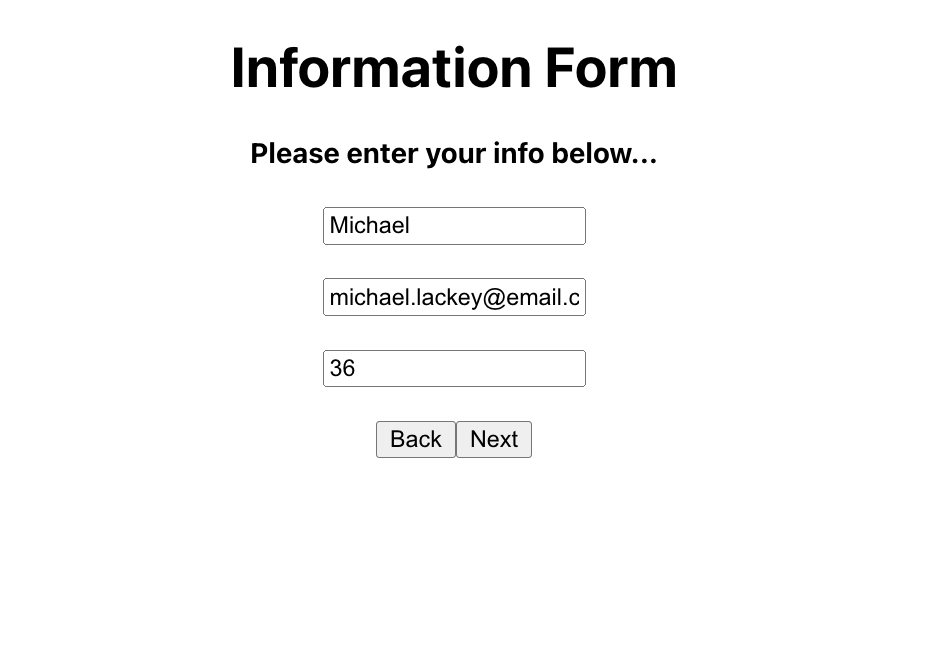
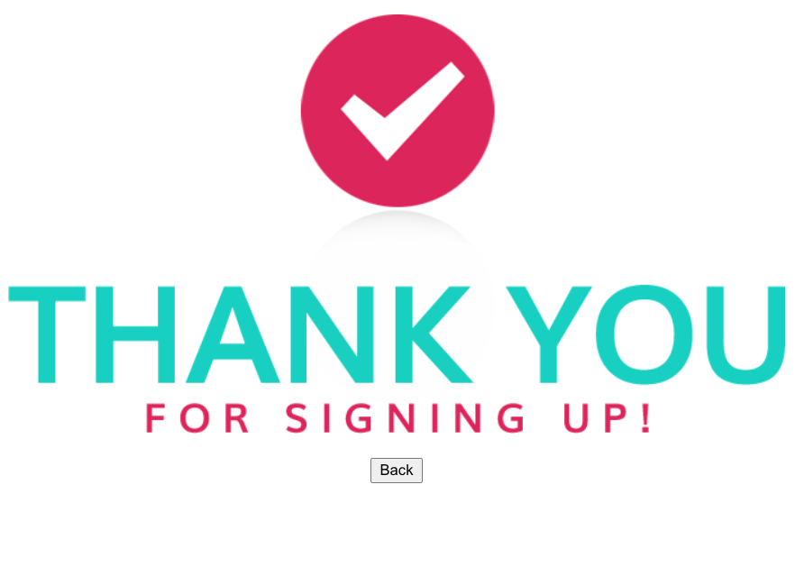
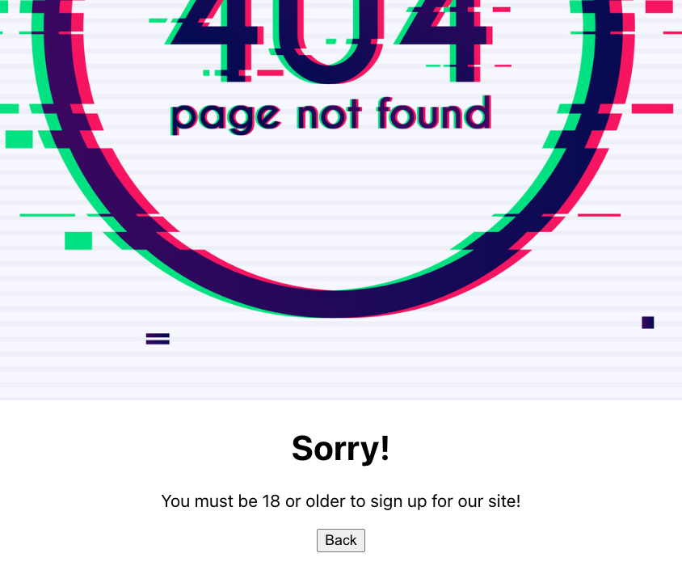

# Conditional Rendering Lab

## Overview

In this lab, we'll be working with a provided sign-up form to conditionally render components based on the user's input.

## Getting Started

- `Fork` and `Clone`
- `cd` into `u4_lab_conditional_rendering`.
- Open up in VSCode with `code .`
- `npm i` to install our dependencies.
- npm run dev to spin up the app
- Navigate to localhost:5173 in your browser

## Instructions

Using the provided components, we're going to create an environment where:

- The user will go through three "pages" of a sign up process (**Landing**, **Form**, then **Thanks** *or* **Error**)
- Once you hook them up, the buttons on each page will navigate the user through the process
- The `Next` button should not clickable unless all 3 fields on the form have user input. [Disabled](https://developer.mozilla.org/en-US/docs/Web/HTML/Attributes/disabled) could be helpful!
- The `Thanks` component renders when a user over the age of 18 signs up OR the `Error` component renders when a user under the age of 18 tries to sign up

## What We're Trying to Build (scroll to the right)

  <pre>
    &nbsp;&nbsp;&nbsp;&nbsp;&nbsp;&nbsp;&nbsp;&nbsp;&nbsp;
  </pre>

1. A landing page that welcomes the user to our site
2. A Form that allows them to "sign up"
3. If everything is filled out correctly, a Thank You page that thanks them for signing up
4. An Error page that appears if the user does not meet the age requirement

## Notes/Tips

- Take a look at what is already provided in the app. Using the state we have, how could we decide which components to render under certain conditions?
- Consider the many conditional statements we've used throughout this course (if/else, switch, ternary). Which would be best for this situation?
- The app **_will not_** render any components until you've called them in the `Home.jsx` render statement...
- The **_majority_** of your work will be done in `Home.jsx`.

## Bonus

- Configure the `Back` buttons to reset the state and return to the welcome page. Maybe a helper method in the `App` component could be useful?
- Style it up!

## Resources
- [Disabled](https://developer.mozilla.org/en-US/docs/Web/HTML/Attributes/disabled)
